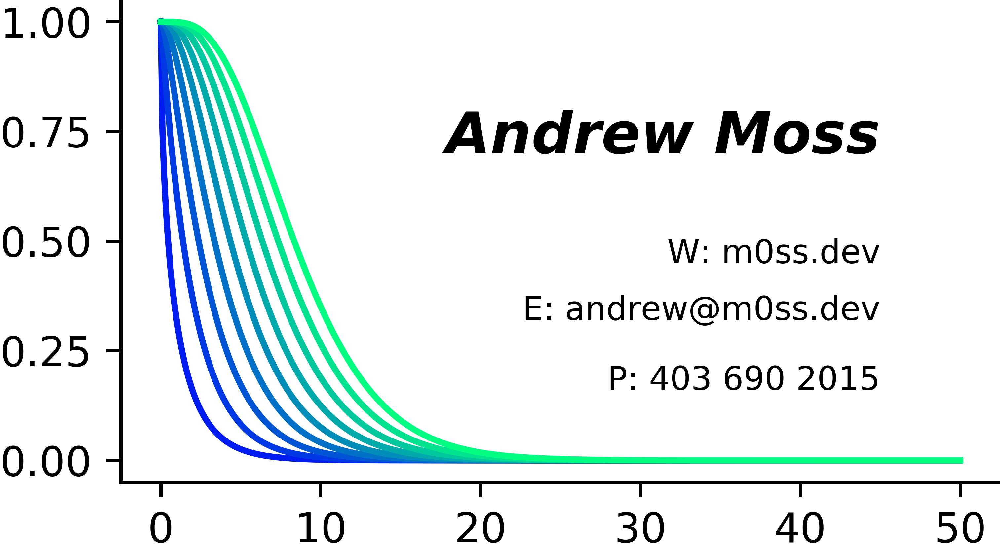

<!DOCTYPE html>
<html>
	<head>
		<style>
			#card {
			width: 100%;
			max-width:400px;
            height:auto;
			}
		</style>
	</head>
	<body>
		<h1 align="center">Card</h1>
		<div align="center" >
			
		</div>
		<div align="center">
			<i>Generative Art Business Card</i>
		</div>
		<br />
		<div align="center">
			<!-- Dependencies -->
			<a>
			
			</a>
			<!-- Size -->
			<a>
			
			</a>
			<!-- Style -->
			<a>
			
			</a>
			<!-- Pylint -->
			<a>
			
			</a>
			<!-- Language -->
			<a>
			
			</a>
			<!-- Language -->
			<a>
			
			</a>
			<!-- License -->
			<a>
			
			</a>
		</div>
		<br />
		<div align="center">
			<sub>Built by
			<a href="https://github.com/agmoss">Andrew Moss</a>
		</div>
		<br />
	</body>
</html>

## Code

```python
"""Card"""
import numpy as np
import scipy.special
import matplotlib.cm as cm
import matplotlib.pyplot as plt

if __name__ == "__main__":

    FIG, AX = plt.subplots()
    FIG.set_size_inches(3.5, 2, forward=True)

    # Remove the plot frame lines
    AX.spines["top"].set_visible(False)
    AX.spines["bottom"].set_visible(True)
    AX.spines["right"].set_visible(False)
    AX.spines["left"].set_visible(True)

    # Text
    AX.text(
        45,
        0.7,
        "Andrew Moss",
        fontsize=14,
        style="oblique",
        horizontalalignment="right",
        weight="bold",
    )
    AX.text(45, 0.45, "W: m0ss.dev", fontsize=8, horizontalalignment="right")
    AX.text(45, 0.32, "E: andrew@m0ss.dev", fontsize=8, horizontalalignment="right")
    AX.text(45, 0.16, "P: 403 690 2015", fontsize=8, horizontalalignment="right")

    # Plot Chi square survival function
    CMAP = cm.get_cmap("winter")
    COLOR = iter(CMAP(np.linspace(0, 1, 10)))
    X = np.linspace(0, 50, 500)
    for i in range(10):
        c = next(COLOR)
        AX.plot(X, scipy.special.chdtrc(i, X), c=c)

    FIG.tight_layout(pad=0.5)
    plt.savefig("./dist/card.png", bbox_inches="tight", pad_inches=0, dpi=900)
    plt.show()
```
